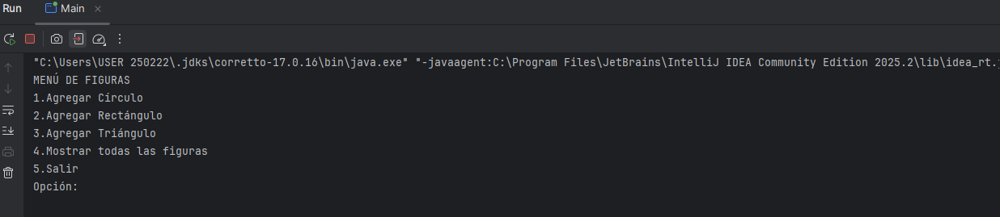
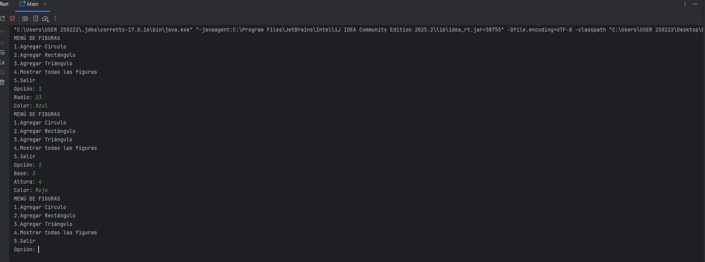
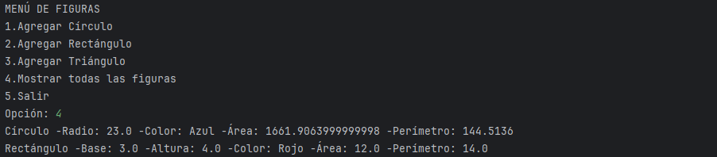

# Documento de Evidencias

## Solución implementada
Para resolver este taller se hicieron tres clases: **Círculo, Rectángulo y Triángulo**.  
Cada clase tiene atributos básicos (como lados, radio, base, altura y color) y métodos que permiten calcular el área y el perímetro.

En el programa principal se creó un **ArrayList** que guarda objetos de las tres figuras.  
Se agregaron al menos dos objetos de cada clase, y luego se recorrió la lista para mostrar la información de cada figura en consola.

De esta forma se cumplió con la práctica de usar colecciones en conjunto con programación orientada a objetos.

---

## Evidencias de la ejecución

### 1. Creación de objetos de cada figura
En la consola se pidieron los datos (radio, base, altura, lados, color) y se construyeron los objetos de las tres figuras.

---

### 2. Inserción de las figuras en el ArrayList
Cada figura creada fue guardada en la colección `ArrayList`.  
Esto permitió almacenar círculos, rectángulos y triángulos en una sola lista.

---

### 3. Resultados de área y perímetro calculados por cada objeto
Al recorrer el `ArrayList`, el programa imprime la información de cada figura, incluyendo su área y perímetro.

Ejemplo de la salida en consola:

